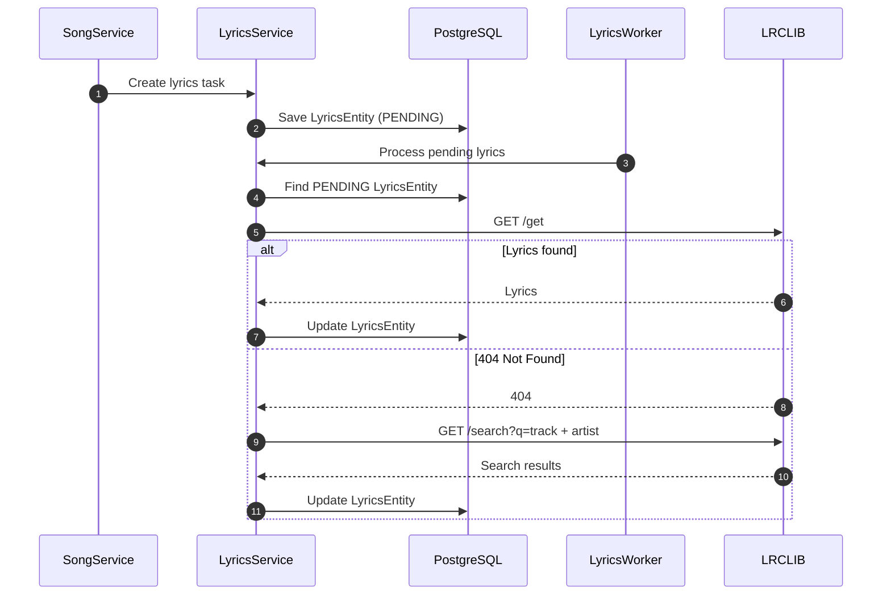

```mermaid
sequenceDiagram
    autonumber

    participant SongService
    participant LyricsService
    participant DB as PostgreSQL
    participant Worker as LyricsWorker
    participant LRCLIB

    SongService->>LyricsService: Create lyrics task
    LyricsService->>DB: Save LyricsEntity (PENDING)

    Worker->>LyricsService: Process pending lyrics
    LyricsService->>DB: Find PENDING LyricsEntity
    LyricsService->>LRCLIB: GET /get

    alt Lyrics found
        LRCLIB-->>LyricsService: Lyrics
        LyricsService->>DB: Update LyricsEntity
    else 404 Not Found
        LRCLIB-->>LyricsService: 404
        LyricsService->>LRCLIB: GET /search?q=track + artist
        LRCLIB-->>LyricsService: Search results
        LyricsService->>DB: Update LyricsEntity
    end
```