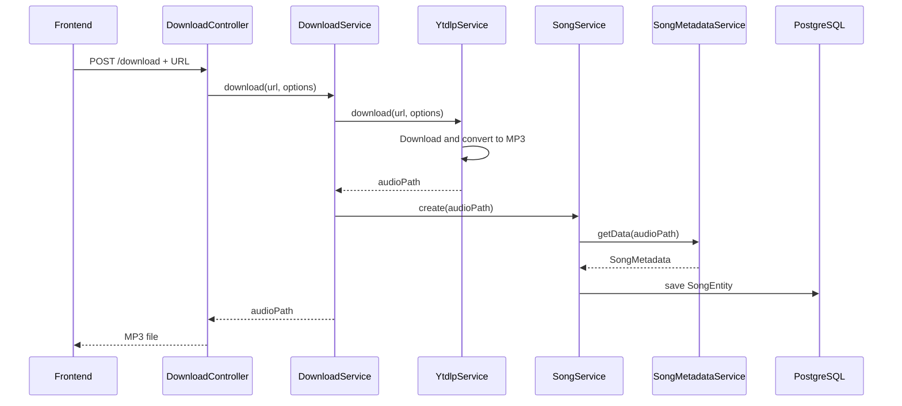

# Flow скачивания песни по URL

```mermaid
sequenceDiagram
participant Frontend
participant DownloadController
participant DownloadService
participant YtdlpService
participant SongService
participant SongMetadataService
participant PostgreSQL

Frontend->>DownloadController: POST /download + URL

DownloadController->>DownloadService: download(url, options)

DownloadService->>YtdlpService: download(url, options)
YtdlpService->>YtdlpService: Download and convert to MP3
YtdlpService-->>DownloadService: audioPath

DownloadService->>SongService: create(audioPath)

SongService->>SongMetadataService: getData(audioPath)
SongMetadataService-->>SongService: SongMetadata

SongService->>PostgreSQL: save SongEntity

DownloadService-->>DownloadController: audioPath

DownloadController-->>Frontend: MP3 file
```